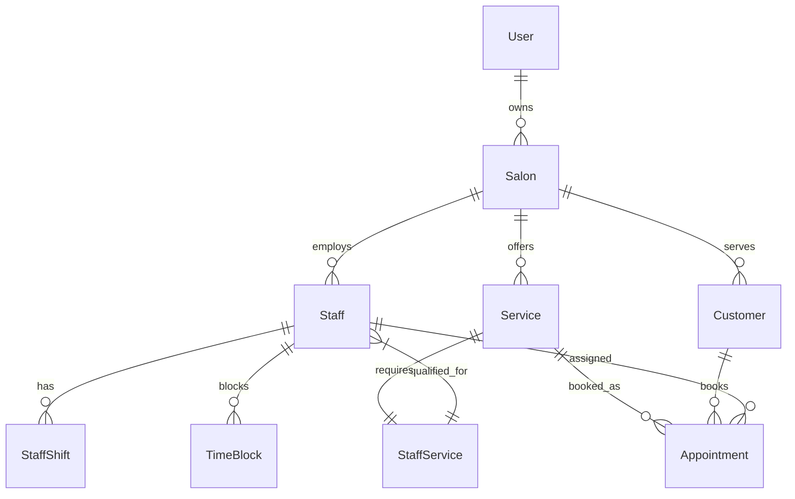

# Data Model: Salon SAAS MVP

**Feature**: 001-salon-saas-mvp  
**Date**: 2025-01-21  
**Version**: 1.0.0

## Entity Relationship Overview



## Core Entities

### User (Authentication & Account Management)
```typescript
interface User {
  id: string                    // UUID primary key
  email: string                 // Unique, auth identifier
  password_hash: string         // Hashed password (bcrypt)
  first_name: string           // User's first name
  last_name: string            // User's last name
  phone?: string               // Optional phone number
  role: UserRole               // OWNER | STAFF | CUSTOMER
  email_verified: boolean      // Email verification status
  created_at: Date             // Account creation timestamp
  updated_at: Date             // Last modification timestamp
  last_login?: Date            // Last login timestamp
  
  // Relationships
  owned_salons?: Salon[]       // For OWNER role
  staff_profile?: Staff        // For STAFF role
  customer_profile?: Customer  // For CUSTOMER role
}

enum UserRole {
  OWNER = 'OWNER',
  STAFF = 'STAFF', 
  CUSTOMER = 'CUSTOMER'
}
```

**Validation Rules**:
- Email must be valid format and unique
- Password minimum 8 characters with complexity requirements
- Phone must be valid format if provided
- Role determines access permissions

**State Transitions**:
- Created → EmailVerification → Active
- Active → Suspended → Active (admin action)
- Active → Deleted (soft delete, retain appointments)

### Salon (Business Profile)
```typescript
interface Salon {
  id: string                   // UUID primary key
  owner_id: string             // Foreign key to User
  name: string                 // Business name
  description?: string         // Business description
  phone: string                // Business phone number
  email: string                // Business email
  website?: string             // Business website URL
  
  // Address
  address_line1: string        // Street address
  address_line2?: string       // Apt/Suite number
  city: string                 // City
  state: string                // State/Province
  postal_code: string          // ZIP/Postal code
  country: string              // Country code
  
  // Business Hours
  timezone: string             // IANA timezone identifier
  business_hours: BusinessHours // Operating hours by day
  
  // Settings
  booking_advance_days: number // Max days in advance for booking
  booking_buffer_minutes: number // Buffer between appointments
  cancellation_hours: number  // Hours notice required for cancellation
  
  // Status
  is_active: boolean           // Business active status
  created_at: Date            // Registration timestamp
  updated_at: Date            // Last modification timestamp
  
  // Relationships
  owner: User                 // Salon owner
  staff: Staff[]              // All staff members
  customers: Customer[]       // All customers
  services: Service[]         // All services offered
  appointments: Appointment[] // All appointments
}

interface BusinessHours {
  monday: DayHours
  tuesday: DayHours
  wednesday: DayHours
  thursday: DayHours
  friday: DayHours
  saturday: DayHours
  sunday: DayHours
}

interface DayHours {
  is_open: boolean            // Whether open this day
  open_time?: string          // Opening time (HH:MM format)
  close_time?: string         // Closing time (HH:MM format)
  break_start?: string        // Break start time
  break_end?: string          // Break end time
}
```

**Validation Rules**:
- Name required, 2-100 characters
- Phone and email must be valid formats
- Timezone must be valid IANA identifier
- Business hours must be logical (open < close)
- Booking settings must be positive numbers

### Staff (Employee Management)
```typescript
interface Staff {
  id: string                   // UUID primary key
  salon_id: string             // Foreign key to Salon
  user_id?: string             // Optional foreign key to User (for login)
  
  // Personal Information
  first_name: string           // Staff first name
  last_name: string            // Staff last name
  email: string                // Staff email (unique within salon)
  phone?: string               // Staff phone number
  
  // Employment Details
  employee_id?: string         // Internal employee identifier
  position: string             // Job title/position
  hire_date: Date              // Employment start date
  hourly_rate?: number         // Hourly pay rate (optional)
  commission_rate?: number     // Commission percentage (0-100)
  
  // Scheduling
  default_hours: BusinessHours // Default working hours
  color_code: string           // Calendar color (hex format)
  
  // Status
  is_active: boolean           // Employment status
  can_login: boolean           // Login access permission
  permissions: StaffPermission[] // System permissions
  created_at: Date            // Record creation timestamp
  updated_at: Date            // Last modification timestamp
  
  // Relationships
  salon: Salon                 // Employing salon
  user?: User                  // Associated user account
  services: StaffService[]     // Qualified services
  shifts: StaffShift[]         // Scheduled shifts
  appointments: Appointment[]  // Assigned appointments
  time_blocks: TimeBlock[]     // Blocked time periods
}

enum StaffPermission {
  VIEW_SCHEDULE = 'VIEW_SCHEDULE',
  MANAGE_OWN_APPOINTMENTS = 'MANAGE_OWN_APPOINTMENTS',
  MANAGE_ALL_APPOINTMENTS = 'MANAGE_ALL_APPOINTMENTS',
  VIEW_CUSTOMERS = 'VIEW_CUSTOMERS',
  MANAGE_CUSTOMERS = 'MANAGE_CUSTOMERS',
  VIEW_REPORTS = 'VIEW_REPORTS',
  MANAGE_SERVICES = 'MANAGE_SERVICES',
  MANAGE_STAFF = 'MANAGE_STAFF'
}
```

**Validation Rules**:
- Names required, 1-50 characters each
- Email must be valid format, unique within salon
- Employee ID unique within salon if provided
- Rates must be non-negative numbers
- Color code must be valid hex format
- At least one permission required if can_login is true

### Customer (Client Management)
```typescript
interface Customer {
  id: string                   // UUID primary key
  salon_id: string             // Foreign key to Salon
  user_id?: string             // Optional foreign key to User (for self-booking)
  
  // Personal Information
  first_name: string           // Customer first name
  last_name: string            // Customer last name
  email?: string               // Customer email (optional)
  phone?: string               // Customer phone number
  date_of_birth?: Date         // Customer birth date
  
  // Preferences
  preferred_staff_ids: string[] // Preferred staff member IDs
  notes?: string               // Customer notes/preferences
  allergies?: string           // Known allergies or sensitivities
  
  // Marketing
  marketing_consent: boolean   // Consent for marketing communications
  preferred_contact: ContactMethod // Preferred contact method
  
  // Status
  is_active: boolean           // Customer status
  created_at: Date            // Record creation timestamp
  updated_at: Date            // Last modification timestamp
  last_visit?: Date           // Most recent appointment date
  
  // Relationships
  salon: Salon                 // Salon they visit
  user?: User                  // Associated user account
  appointments: Appointment[]  // All appointments
}

enum ContactMethod {
  EMAIL = 'EMAIL',
  PHONE = 'PHONE',
  SMS = 'SMS',
  NONE = 'NONE'
}
```

**Validation Rules**:
- First name required, 1-50 characters
- Email must be valid format if provided
- At least email or phone required for contact
- Notes limited to 1000 characters
- Date of birth must be in the past

### Service (Service Catalog)
```typescript
interface Service {
  id: string                   // UUID primary key
  salon_id: string             // Foreign key to Salon
  
  // Service Details
  name: string                 // Service name
  description?: string         // Service description
  category: ServiceCategory    // Service category
  duration_minutes: number     // Service duration
  price: number                // Base price
  
  // Configuration
  buffer_before_minutes: number // Setup time before service
  buffer_after_minutes: number // Cleanup time after service
  color_code: string           // Calendar color (hex format)
  
  // Booking Rules
  is_active: boolean           // Service availability
  requires_deposit: boolean    // Deposit required flag
  deposit_amount?: number      // Deposit amount if required
  cancellation_policy?: string // Cancellation terms
  
  // Scheduling
  max_advance_booking_days?: number // Max days in advance
  min_advance_booking_hours?: number // Min hours in advance
  
  created_at: Date            // Record creation timestamp
  updated_at: Date            // Last modification timestamp
  
  // Relationships
  salon: Salon                 // Offering salon
  staff_qualifications: StaffService[] // Qualified staff
  appointments: Appointment[]  // Service bookings
}

enum ServiceCategory {
  HAIRCUT = 'HAIRCUT',
  HAIR_COLOR = 'HAIR_COLOR',
  HAIR_STYLING = 'HAIR_STYLING',
  NAILS = 'NAILS',
  FACIAL = 'FACIAL',
  MASSAGE = 'MASSAGE',
  WAXING = 'WAXING',
  EYEBROWS = 'EYEBROWS',
  MAKEUP = 'MAKEUP',
  OTHER = 'OTHER'
}
```

**Validation Rules**:
- Name required, 1-100 characters
- Duration must be positive, typically 15-480 minutes
- Price must be non-negative
- Buffer times must be non-negative
- Color code must be valid hex format
- Deposit amount required if requires_deposit is true

### StaffService (Staff-Service Qualification)
```typescript
interface StaffService {
  id: string                   // UUID primary key
  staff_id: string             // Foreign key to Staff
  service_id: string           // Foreign key to Service
  
  // Pricing Override
  custom_price?: number        // Staff-specific pricing
  custom_duration_minutes?: number // Staff-specific duration
  
  // Qualification
  certified_date?: Date        // Certification date
  certification_level?: CertificationLevel // Skill level
  notes?: string               // Additional notes
  
  is_active: boolean           // Currently qualified
  created_at: Date            // Record creation timestamp
  updated_at: Date            // Last modification timestamp
  
  // Relationships
  staff: Staff                 // Qualified staff member
  service: Service             // Service qualification
}

enum CertificationLevel {
  TRAINEE = 'TRAINEE',
  JUNIOR = 'JUNIOR',
  SENIOR = 'SENIOR',
  MASTER = 'MASTER'
}
```

**Validation Rules**:
- Staff and service combination must be unique
- Custom price must be non-negative if provided
- Custom duration must be positive if provided
- Certification date cannot be in the future

### Appointment (Booking Management)
```typescript
interface Appointment {
  id: string                   // UUID primary key
  salon_id: string             // Foreign key to Salon
  customer_id: string          // Foreign key to Customer
  staff_id: string             // Foreign key to Staff
  service_id: string           // Foreign key to Service
  
  // Scheduling
  start_time: Date             // Appointment start time
  end_time: Date               // Appointment end time
  timezone: string             // Appointment timezone
  
  // Pricing
  service_price: number        // Agreed service price
  deposit_paid?: number        // Deposit amount paid
  total_paid?: number          // Total amount paid
  
  // Status & Notes
  status: AppointmentStatus    // Current status
  customer_notes?: string      // Customer special requests
  staff_notes?: string         // Staff private notes
  cancellation_reason?: string // Reason for cancellation
  
  // Notifications
  reminder_sent: boolean       // Reminder notification sent
  confirmation_sent: boolean   // Confirmation sent
  
  // Audit
  created_at: Date            // Booking creation timestamp
  updated_at: Date            // Last modification timestamp
  created_by_user_id: string  // User who created booking
  
  // Relationships
  salon: Salon                 // Appointment salon
  customer: Customer           // Appointment customer
  staff: Staff                 // Assigned staff member
  service: Service             // Booked service
  created_by: User             // Booking creator
}

enum AppointmentStatus {
  CONFIRMED = 'CONFIRMED',     // Appointment confirmed
  PENDING = 'PENDING',         // Awaiting confirmation
  CANCELLED = 'CANCELLED',     // Cancelled by customer/salon
  NO_SHOW = 'NO_SHOW',        // Customer didn't arrive
  COMPLETED = 'COMPLETED',     // Service completed
  IN_PROGRESS = 'IN_PROGRESS'  // Currently being serviced
}
```

**Validation Rules**:
- Start time must be in the future (for new appointments)
- End time must be after start time
- Duration should match service duration (with tolerances)
- Staff must be qualified for the service
- No double-booking conflicts for staff
- Price must match service price (or custom staff price)

### StaffShift (Work Schedule)
```typescript
interface StaffShift {
  id: string                   // UUID primary key
  staff_id: string             // Foreign key to Staff
  
  // Shift Details
  start_time: Date             // Shift start time
  end_time: Date               // Shift end time
  shift_type: ShiftType        // Type of shift
  
  // Break Information
  break_start?: Date           // Break start time
  break_end?: Date             // Break end time
  
  // Recurring Pattern
  is_recurring: boolean        // Recurring shift flag
  recurrence_pattern?: RecurrencePattern // Pattern details
  recurrence_end_date?: Date   // End date for recurrence
  
  // Status
  is_active: boolean           // Shift active status
  notes?: string               // Shift notes
  
  created_at: Date            // Record creation timestamp
  updated_at: Date            // Last modification timestamp
  
  // Relationships
  staff: Staff                 // Staff member
}

enum ShiftType {
  REGULAR = 'REGULAR',         // Regular scheduled shift
  OVERTIME = 'OVERTIME',       // Overtime shift
  VACATION = 'VACATION',       // Vacation time
  SICK_LEAVE = 'SICK_LEAVE',   // Sick leave
  TRAINING = 'TRAINING'        // Training time
}

interface RecurrencePattern {
  frequency: RecurrenceFrequency // How often repeats
  interval: number             // Every N frequency units
  days_of_week?: number[]      // Days of week (0=Sunday)
  day_of_month?: number        // Day of month
  week_of_month?: number       // Week of month
}

enum RecurrenceFrequency {
  DAILY = 'DAILY',
  WEEKLY = 'WEEKLY',
  MONTHLY = 'MONTHLY'
}
```

**Validation Rules**:
- Start time must be before end time
- Break times must be within shift duration
- Recurrence pattern must be valid for frequency
- No overlapping shifts for same staff member
- Regular shifts must be within salon business hours

### TimeBlock (Unavailable Periods)
```typescript
interface TimeBlock {
  id: string                   // UUID primary key
  staff_id: string             // Foreign key to Staff
  
  // Time Block Details
  start_time: Date             // Block start time
  end_time: Date               // Block end time
  title: string                // Block title/reason
  description?: string         // Block description
  block_type: TimeBlockType    // Type of block
  
  // Recurring Pattern
  is_recurring: boolean        // Recurring block flag
  recurrence_pattern?: RecurrencePattern // Pattern details
  recurrence_end_date?: Date   // End date for recurrence
  
  // Status
  is_active: boolean           // Block active status
  
  created_at: Date            // Record creation timestamp
  updated_at: Date            // Last modification timestamp
  created_by_user_id: string  // User who created block
  
  // Relationships
  staff: Staff                 // Staff member
  created_by: User             // Block creator
}

enum TimeBlockType {
  BREAK = 'BREAK',             // Break time
  LUNCH = 'LUNCH',             // Lunch break
  MEETING = 'MEETING',         // Staff meeting
  TRAINING = 'TRAINING',       // Training session
  PERSONAL = 'PERSONAL',       // Personal time off
  MAINTENANCE = 'MAINTENANCE'  // Equipment maintenance
}
```

**Validation Rules**:
- Start time must be before end time
- Title required, 1-100 characters
- No overlapping time blocks for same staff
- Recurring pattern must be valid if specified

## Database Indexing Strategy

### Primary Indexes
- All primary keys (UUID) with btree indexes
- Foreign key relationships for join optimization

### Performance Indexes
```sql
-- Appointment queries by date range and staff
CREATE INDEX idx_appointments_staff_date ON appointments(staff_id, start_time);

-- Customer search by name and phone
CREATE INDEX idx_customers_search ON customers(salon_id, first_name, last_name, phone);

-- Staff schedule queries
CREATE INDEX idx_staff_shifts_date ON staff_shifts(staff_id, start_time, end_time);

-- Service availability queries
CREATE INDEX idx_staff_services_active ON staff_services(service_id, is_active);

-- Time block overlap prevention
CREATE INDEX idx_time_blocks_overlap ON time_blocks(staff_id, start_time, end_time);
```

### Unique Constraints
```sql
-- Prevent duplicate staff-service qualifications
UNIQUE(staff_id, service_id) ON staff_services;

-- Unique email per salon for staff
UNIQUE(salon_id, email) ON staff WHERE email IS NOT NULL;

-- Unique employee ID per salon
UNIQUE(salon_id, employee_id) ON staff WHERE employee_id IS NOT NULL;
```

## Data Migration Strategy

### Phase 1: Core Setup
1. Create database schema with all tables
2. Set up user authentication system
3. Create salon profile and settings
4. Import basic service catalog

### Phase 2: Staff & Schedule
1. Add staff members with basic information
2. Set up default working hours
3. Create initial staff-service qualifications
4. Configure shift patterns

### Phase 3: Customer & Appointments
1. Import existing customer database
2. Migrate historical appointment data
3. Set up recurring appointments
4. Configure notification preferences

### Data Validation & Cleanup
- Validate all email formats and phone numbers
- Ensure referential integrity across all relationships
- Verify business logic constraints (no double bookings)
- Set up audit triggers for sensitive data changes

---
**Status**: Complete ✅  
**Entity Count**: 8 core entities + 3 junction tables  
**Relationship Integrity**: Verified  
**Ready for Contract Generation**: Yes